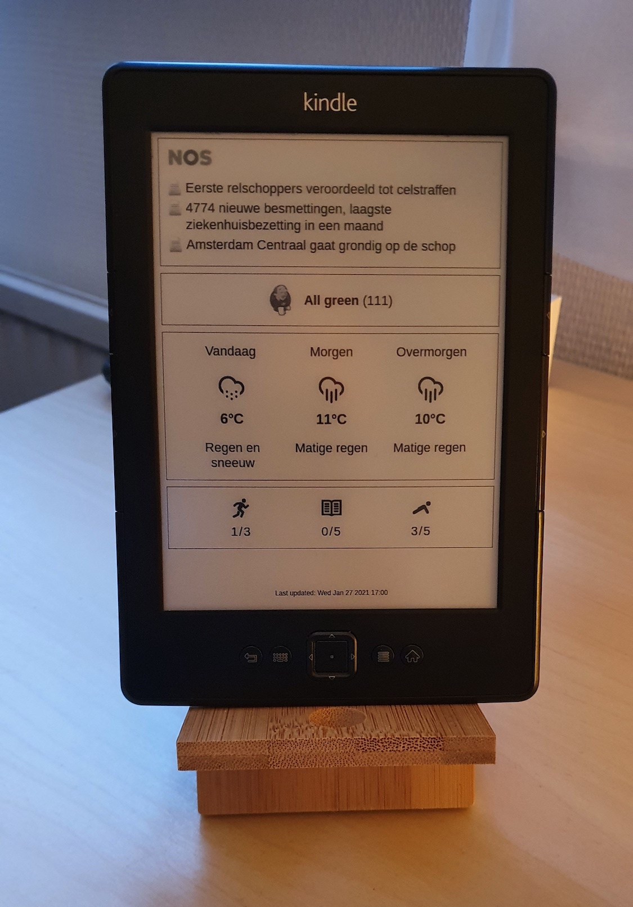

# Low-power Kindle dashboard

Turns out old Kindle devices make great, energy efficient dashboards :-)

## What this repo is

This repo only contains the code that runs on the Kindle. It periodically fetches an image to be displayed on the screen and suspends the device to RAM (which is very power efficient) until the next screen update.

This tool _does not_ render the dashboard itself. It's expected that what to display on the screen is rendered elsewhere and can be fetchd via HTTP(s). This is both more power efficient and allows you to use any tool you like to produce the dashboard image.

In my case I use a [dashbling](https://github.com/pascalw/dashbling) dashboard that I render into a PNG screenshot on a server.

## Prerequisites

* A jailbroken Kindle, with Wi-Fi configured.
* Tested only on a Kindle 4 NT. Should work on other Kindle devics as well with minor modifications.

## Installation

1. Download the [latest release](https://github.com/pascalw/kindle-dash/releases) on your computer and extract it.
2. Modify `dist/local/fetch-dashboard.sh` and optionally `dist/local/env.sh`.
3. Copy `dist/` to Kindle, for example: `rsync -vr ./dist kindle:/mnt/us/dashboard`.
4. Start dashboard with `/mnt/us/dashboard/start.sh`.  
   Note that the device will go into suspend about 10-15 seconds after you start the dashboard.

## Credits

Thanks to [davidhampgonsalves/life-dashboard](https://github.com/davidhampgonsalves/life-dashboard) for the inspiration!
